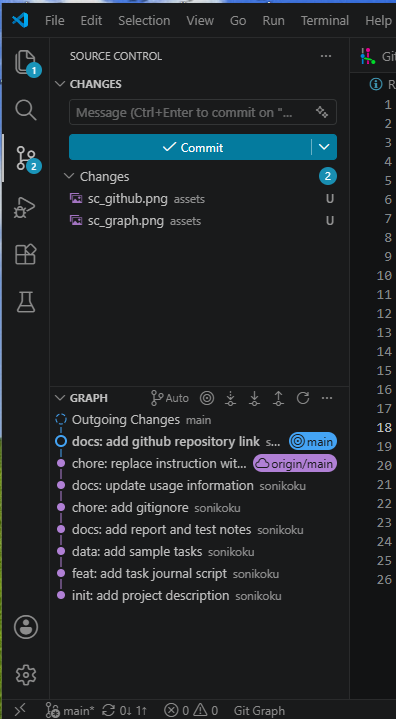
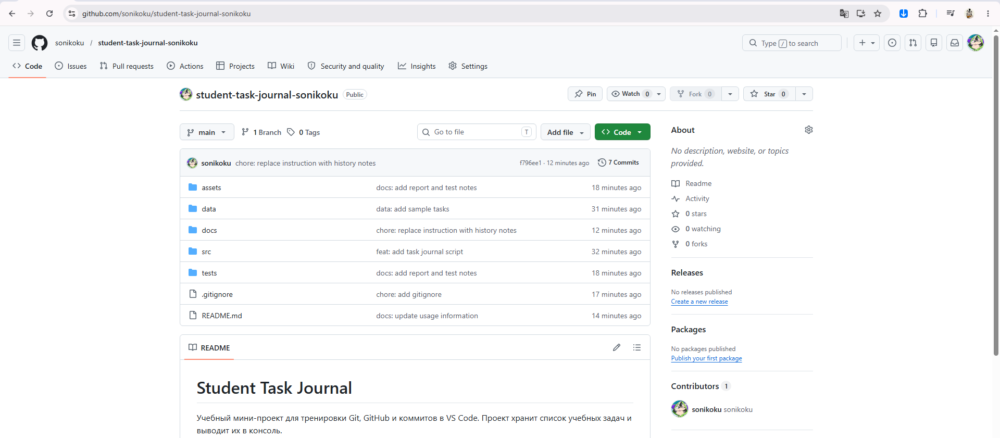
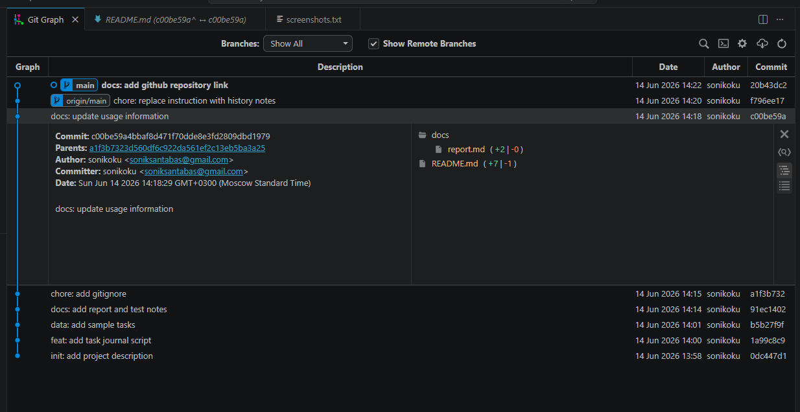

# Student Task Journal

Учебный мини-проект для тренировки Git, GitHub и коммитов в VS Code.
Проект хранит список учебных задач и выводит их в консоль.

## Автор
ФИО: Соня С.
Группа: РПО 2

## Как запустить

1. Откройте терминал в корне проекта.
2. Выполните команду: python src/main.py
3. Проверьте, что в консоли появились задачи.

## Скриншоты проекта

### 1. Source Control с изменениями

### 2. GitHub-репозиторий

### 3. Git Graph с историей коммитов
